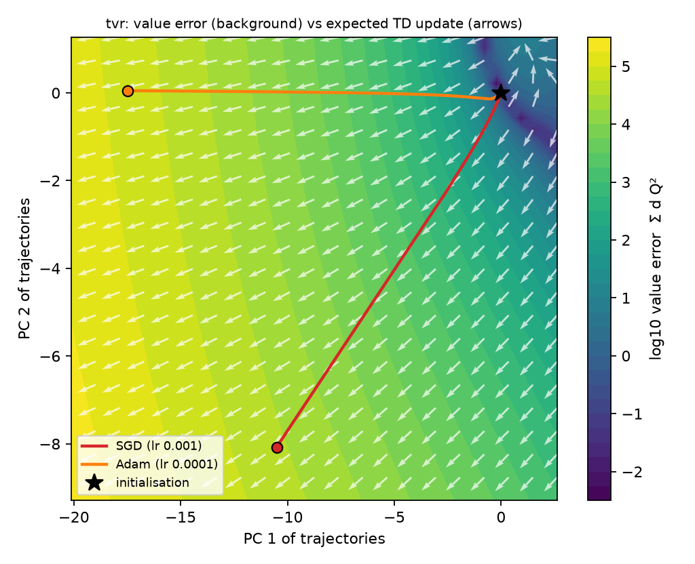
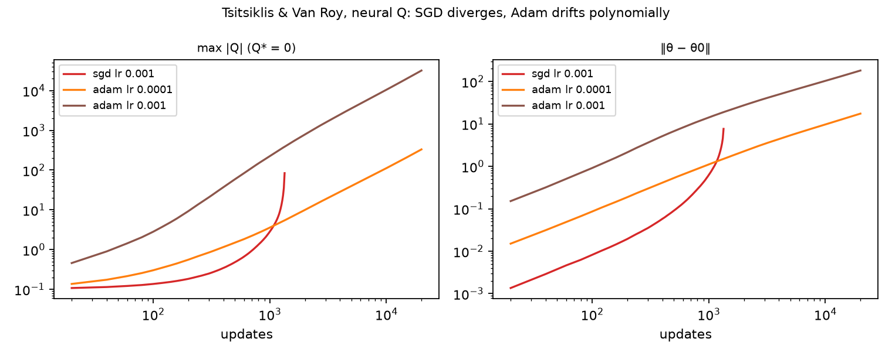
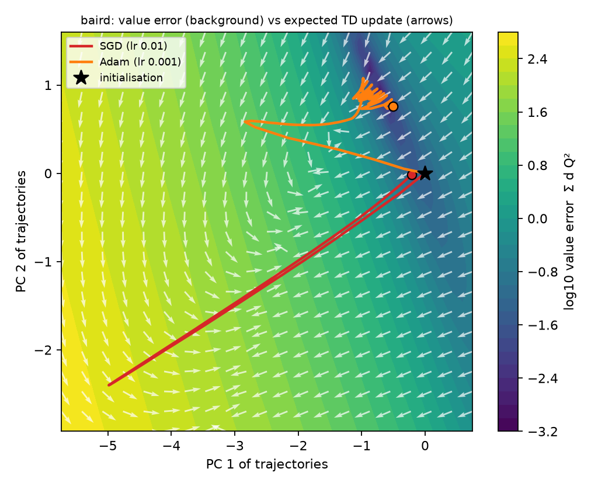
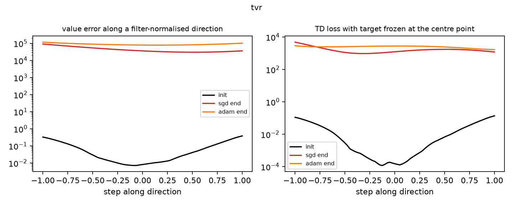

# Relaxed Q-learning and the deadly triad

Does over-relaxation (ω > 1) or under-relaxation (ω < 1) of the Q-learning target change the
outcome on the classic divergence counterexamples for off-policy learning with function
approximation? This repository tests the successive over-relaxation (SOR) target

$$
y_\omega(s,a) \;=\; \omega\,\bigl(r + \gamma \max_{a'} Q(s',a')\bigr) \;+\; (1-\omega)\,\max_{c} Q(s,c),
$$

where ω = 1 recovers Q-learning (Watkins & Dayan, 1992) and ω ≠ 1 gives SOR Q-learning
(Kamanchi et al., 2020; after Young, 1954), on:

- **Tsitsiklis & Van Roy's two-state example** (Tsitsiklis & Van Roy, 1997; Sutton & Barto, 2018,
  Example 11.1, without termination), and
- **Baird's star counterexample** (Baird, 1995; Sutton & Barto, 2018, Fig. 11.1), in a
  two-action control form,

each with three representations: tabular, linear, and a small neural network trained with SGD
or Adam (Kingma & Ba, 2015). All updates are semi-gradient, off-policy and bootstrapped, without
a target network, i.e. the "deadly triad" (Sutton & Barto, 2018, §11.3; van Hasselt et al.,
2018).

## Summary of findings

1. **Relaxation does not remove the deadly triad.** With linear features, both counterexamples
   diverge for every ω tested (0.3 to 2.0) at the larger step sizes; ω changes how fast the
   error grows, not whether it grows.
2. **On Tsitsiklis & Van Roy's example, ω is only a step size.** With a single action,
   max_c Q(s, c) = Q(s), so the SOR target rescales the TD error by ω. The expected linear
   update is θ ← θ + α ω (6γ − 5)/2 · θ, so the divergence threshold γ > 5/6 does not depend
   on ω (verified in `tests/`). The neural learner diverges under SGD for every ω; under Adam its
   error is the same for every ω, because Adam normalises away a constant rescaling of the
   gradient.
3. **Adam hides divergence as drift.** On the same example, Adam never crosses the divergence
   threshold but ends far from Q* = 0, identically for all ω.
4. **Tabular learning is stable for all ω tested, and its error falls faster for larger ω**, as
   expected when states repeat (the lower state of Baird's star loops on itself). At the
   smallest step size the error is still decreasing after 20,000 updates.
5. **With a neural network on Baird's features, the classic trap largely disappears**, and the
   effect of ω depends on the optimiser. Under SGD with the larger step, under-relaxed targets
   (ω ≤ 0.5) diverge in some seeds while over-relaxed ones converge fastest; with the smaller
   step the error is largest near ω = 1 and smaller on both sides. Under Adam there is no
   consistent effect of ω.

## Results

`max |Q|` after 20,000 updates; since every reward is zero, this is the distance from
Q* = Q_ω* = 0. **DIV** means |Q| exceeded 10⁶ or became non-finite. Tabular and linear rows use
expected (noise-free) updates and one run; neural rows give the median over 5 seeds of the
non-divergent runs, with the number of divergent seeds in brackets.

#### Tsitsiklis & Van Roy

| representation | update | step size | w=0.3 | w=0.5 | w=0.7 | w=0.9 | w=1.0 | w=1.1 | w=1.3 | w=1.5 | w=2.0 |
|---|---|---|---|---|---|---|---|---|---|---|---|
| tabular | expected | 0.01 | 1.5e+00 | 1.2e+00 | 9.9e-01 | 8.1e-01 | 7.4e-01 | 6.7e-01 | 5.5e-01 | 4.5e-01 | 2.7e-01 |
| tabular | expected | 0.1 | 1.0e-01 | 1.3e-02 | 1.8e-03 | 2.5e-04 | 9.1e-05 | 3.3e-05 | 4.5e-06 | 6.1e-07 | 4.1e-09 |
| tabular | expected | 0.5 | 6.1e-07 | 2.7e-11 | 1.2e-15 | 5.4e-20 | 3.6e-22 | 2.4e-24 | 1.1e-28 | 4.7e-33 | 5.8e-44 |
| linear | expected | 0.01 | DIV | DIV | DIV | DIV | DIV | DIV | DIV | DIV | DIV |
| linear | expected | 0.1 | DIV | DIV | DIV | DIV | DIV | DIV | DIV | DIV | DIV |
| linear | expected | 0.5 | DIV | DIV | DIV | DIV | DIV | DIV | DIV | DIV | DIV |
| neural | sgd | 0.001 | - (5/5 div) | - (5/5 div) | - (5/5 div) | - (5/5 div) | - (5/5 div) | - (5/5 div) | - (5/5 div) | - (5/5 div) | - (5/5 div) |
| neural | sgd | 0.01 | - (5/5 div) | - (5/5 div) | - (5/5 div) | - (5/5 div) | - (5/5 div) | - (5/5 div) | - (5/5 div) | - (5/5 div) | - (5/5 div) |
| neural | adam | 0.0001 | 3.3e+02 | 3.3e+02 | 3.3e+02 | 3.3e+02 | 3.3e+02 | 3.3e+02 | 3.3e+02 | 3.3e+02 | 3.3e+02 |
| neural | adam | 0.001 | 3.2e+04 | 3.2e+04 | 3.2e+04 | 3.2e+04 | 3.2e+04 | 3.2e+04 | 3.2e+04 | 3.2e+04 | 3.2e+04 |

#### Baird's star (control form)

| representation | update | step size | w=0.3 | w=0.5 | w=0.7 | w=0.9 | w=1.0 | w=1.1 | w=1.3 | w=1.5 | w=2.0 |
|---|---|---|---|---|---|---|---|---|---|---|---|
| tabular | expected | 0.01 | 1.2e+01 | 1.2e+01 | 1.2e+01 | 1.2e+01 | 1.2e+01 | 1.1e+01 | 1.1e+01 | 1.1e+01 | 1.1e+01 |
| tabular | expected | 0.1 | 1.1e+01 | 9.8e+00 | 9.0e+00 | 8.3e+00 | 8.0e+00 | 7.7e+00 | 7.1e+00 | 6.5e+00 | 5.3e+00 |
| tabular | expected | 0.5 | 6.5e+00 | 4.3e+00 | 2.9e+00 | 1.9e+00 | 1.6e+00 | 1.3e+00 | 8.5e-01 | 5.6e-01 | 2.0e-01 |
| linear | expected | 0.01 | 4.6e+02 | 2.0e+03 | 8.1e+03 | 3.2e+04 | 6.4e+04 | 1.3e+05 | 4.9e+05 | DIV | DIV |
| linear | expected | 0.1 | DIV | DIV | DIV | DIV | DIV | DIV | DIV | DIV | DIV |
| linear | expected | 0.5 | DIV | DIV | DIV | DIV | DIV | DIV | DIV | DIV | DIV |
| neural | sgd | 0.001 | 1.2e+00 | 1.4e+00 | 2.5e+00 | 6.2e+00 | 1.2e+01 | 1.4e+01 | 8.7e+00 | 5.8e+00 | 3.0e+00 |
| neural | sgd | 0.01 | 1.3e+00 (2/5 div) | 6.5e-01 (1/5 div) | 3.7e-01 | 2.5e-01 | 2.1e-01 | 1.8e-01 | 1.3e-01 | 9.6e-02 | 4.3e-02 |
| neural | adam | 0.0001 | 3.3e-02 | 1.3e-04 | 2.4e-03 | 2.9e-03 | 1.8e-03 | 8.1e-03 | 2.3e-02 | 2.8e-03 | 2.3e-04 |
| neural | adam | 0.001 | 9.9e-02 | 3.8e-02 | 7.1e-02 | 1.2e-03 | 5.7e-02 | 2.6e-02 | 2.0e-05 | 1.1e-03 | 6.1e-05 |

## Optimisation geometry: why Adam drifts where SGD diverges

`viz/landscape.py` visualises the neural learner (ω = 1, seed 0). Semi-gradient TD is not
gradient descent on a fixed loss: its target moves with the parameters, so its update field is in
general not the gradient of any function. The plots therefore draw the expected TD update against a
*fixed* objective, the value error E(θ) = Σ d(s,a) Q_θ(s,a)² (Q* = 0 here), on a plane through the
initial parameters spanned by the first two principal components of the SGD and Adam trajectories
(Li et al., 2018, §7). Arrows are the expected update projected onto that plane.



**Tsitsiklis & Van Roy.** Almost everywhere on the plane, the expected TD update points *away* from
the low-error region: following the update increases the true error. This is the deadly triad as a
picture. Both optimisers follow the field outward. SGD's steps scale with the update, which grows
with the error, so it accelerates and diverges after about 1,340 updates. Adam normalises each
parameter's step to roughly its learning rate, so it moves outward along a nearly straight line at
bounded speed.



**The Adam "plateau" is slow, unbounded drift.** On log–log axes, Adam's distance from its
initialisation grows as about t^0.8–0.85 and max |Q| as about t^1.5–1.6, so max |Q| grows roughly as
the square of the parameter displacement, as expected for a two-layer network whose output is a
product of two weight layers. A tenfold learning rate therefore gives roughly a hundredfold larger
error after the same number of updates (332 against 3.2 × 10⁴ after 20,000). SGD instead grows
super-exponentially and crosses the divergence threshold. Neither converges; the difference is only
the speed at which they leave.



**Baird's star.** Here the field rotates and partly points into a low-error valley. Adam spirals into
that valley and settles with small oscillations (final value error 0.012); SGD makes a long
excursion away from the initialisation before returning (final value error 0.047). With a
non-linear network the classic linear trap is largely avoided, consistent with the results table.



The 1-D slices (Li et al., 2018, filter-normalised random direction) show the value error and the
TD loss with its target frozen at the centre point. The frozen-target loss always has a minimum
near the centre, which is what each update descends; the value error along the same direction
does not, which is why descending a sequence of frozen-target losses need not reduce it. The
Baird slices are in `viz/figures/fig_slices_baird.png`.

These are two-dimensional projections of a 97-parameter (Tsitsiklis & Van Roy) and 354-parameter
(Baird) space, from a single seed; they illustrate the mechanisms in the table rather than measure
them.

## Setup

| | |
|---|---|
| Discount | γ = 0.99 |
| Tabular, linear | expected synchronous updates, θ ← θ + α Σ_{s,a} d(s,a) φ(s,a) (E[y_ω] − Q(s,a)), α ∈ {0.01, 0.1, 0.5} |
| Neural | one hidden layer of 32 ReLU units on the state features, minibatches of 32 sampled (s, a) from d with sampled s′, squared loss, SGD (lr 1e-3, 1e-2) or Adam (lr 1e-4, 1e-3), 5 seeds |
| Relaxation | ω ∈ {0.3, 0.5, 0.7, 0.9, 1.0, 1.1, 1.3, 1.5, 2.0} |
| Initialisation | linear weights (1, 1, 1, 1, 1, 1, 10, 1) per action block (Sutton & Barto, 2018); tabular values equal to the linear ones; default PyTorch initialisation for the network |

**Tsitsiklis & Van Roy.** Two states with features 1 and 2, s₁ → s₂ → s₂, zero reward, one
action and uniform weighting over states.

**Baird's star (control form).** Six upper states and one lower state with the features of
Sutton & Barto (2018, Fig. 11.1). Action *dashed* moves to a uniformly random upper state;
action *solid* moves to the lower state. The behaviour policy takes dashed with probability 6/7,
so each state is visited with probability 1/7. Q is linear in a separate copy of the features
for each action. This two-action form is our construction for testing the max in the SOR target;
Baird (1995) and Sutton & Barto (2018) present the problem for policy evaluation.

## Usage

```bash
pip install -r requirements.txt matplotlib
python -m pytest                    # analytic checks, a few seconds
python run.py                       # full grid, about 10-15 minutes on 8 cores
python run.py --steps 2000 --seeds 1 --workers 2   # quick check
python viz/landscape.py             # figures in viz/figures/, about a minute
```

`run.py` writes `results/results.jsonl` (one record per run) and `results/summary.md` (the
tables above).

## Layout

```
sor_triad/problems.py   the two counterexamples and their feature maps
sor_triad/learners.py   the SOR target; expected-update and neural learners
run.py                  the experiment grid and summary tables
viz/landscape.py        optimisation-geometry figures (update field, slices, drift)
tests/                  closed-form and sanity checks
results/                results.jsonl, summary.md, run.log
```

## Limitations

- All rewards are zero, so these experiments measure stability, not the quality of learned
  values or policies.
- 20,000 updates: slowly growing linear runs at the smallest step size would cross the
  divergence threshold eventually.
- The neural learner has no target network or replay buffer; both are standard stabilisers in
  deep Q-learning (Mnih et al., 2015) and are deliberately absent here.

## References

- Baird, L. (1995). Residual algorithms: Reinforcement learning with function approximation.
  *Proceedings of the 12th International Conference on Machine Learning (ICML)*.
- Kamanchi, C., Diddigi, R. B., & Bhatnagar, S. (2020). Successive over-relaxation Q-learning.
  *IEEE Control Systems Letters*, 4(1).
- Kingma, D. P., & Ba, J. (2015). Adam: A method for stochastic optimization. *International
  Conference on Learning Representations (ICLR)*.
- Li, H., Xu, Z., Taylor, G., Studer, C., & Goldstein, T. (2018). Visualizing the loss landscape
  of neural nets. *Advances in Neural Information Processing Systems (NeurIPS)*.
- Mnih, V., et al. (2015). Human-level control through deep reinforcement learning. *Nature*,
  518, 529–533.
- Sutton, R. S., & Barto, A. G. (2018). *Reinforcement Learning: An Introduction* (2nd ed.),
  Chapter 11. MIT Press.
- Tsitsiklis, J. N., & Van Roy, B. (1997). An analysis of temporal-difference learning with
  function approximation. *IEEE Transactions on Automatic Control*, 42(5).
- van Hasselt, H., Doron, Y., Strub, F., Hessel, M., Sonnerat, N., & Modayil, J. (2018). Deep
  reinforcement learning and the deadly triad. *arXiv:1812.02648*.
- Watkins, C. J. C. H., & Dayan, P. (1992). Q-learning. *Machine Learning*, 8, 279–292.
- Young, D. M. (1954). Iterative methods for solving partial difference equations of elliptic
  type. *Transactions of the American Mathematical Society*, 76(1).
